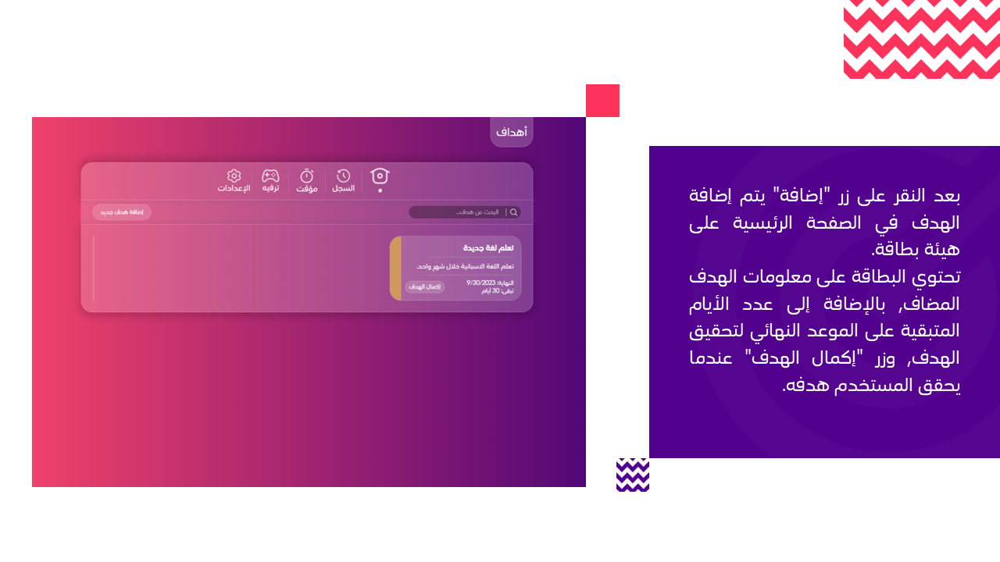

# Ahdaf

Ahdaf is a platform to track your Goals, derived from the Arabic word for Goals. It is a simple, yet powerful tool to help you achieve your goals.


## Table of Contents

- [Installation](#installation)
- [Usage](#usage)
- [To-Do List](#to-do-list)
- [User Journey](#user-journey)

## Installation

To get started with this project, follow these steps:

**1. Clone the repository:**

```bash
git clone https://github.com/AbdulrahmanAlGhofaily/ahdaf
cd ahdaf
```

**2. Install the dependencies:**

```bash
npm install
```

## Usage

To start the development server, open the terminal run the following command:

```bash
ng serve
```

This will start the development server. Open your browser and navigate to http://localhost:4200 to view the app.

## To-Do List

Here's a list of tasks to improve and extend the Ahdaf project:

- [ ] Add a timer to the app
- [ ] Add history feature
- [ ] Add responsivity
- [ ] Add more games
- [ ] Fix settings tab (some buttons don't work)
- [ ] Develop a backend to store Goals in a Database
- [ ] Add a login system

Feel free to contribute to the project by working on these tasks or by adding new features. If you have any questions or suggestions, please open an issue or reach out to the project maintainers.

## User Journey





